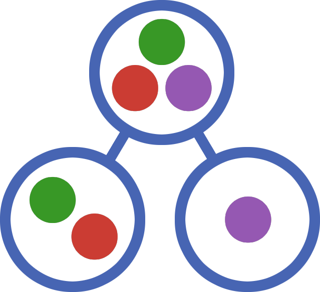

<div align="center">
    
</div>
<h1 align="center">
    CliqueTrees.jl
    <p align="center">
        <a href="https://algebraicjulia.github.io/CliqueTrees.jl/stable">
            
        </a>
        <a href="https://algebraicjulia.github.io/CliqueTrees.jl/dev">
            
        </a>
        <a href="https://github.com/AlgebraicJulia/CliqueTrees.jl/actions/workflows/julia_ci.yml">
            
        </a>
        <a href="https://codecov.io/gh/AlgebraicJulia/CliqueTrees.jl">
            
        </a>
        <a href="https://github.com/invenia/BlueStyle">
            
        </a>
        <a href="https://github.com/JuliaTesting/Aqua.jl">
            
        </a>
        <a href="https://github.com/aviatesk/JET.jl">
            
        </a>
    </p>
</h2>

CliqueTrees.jl implements *clique trees* in Julia. You can use it to construct [tree decompositions](https://en.wikipedia.org/wiki/Tree_decomposition) and [chordal completions](https://en.wikipedia.org/wiki/Chordal_completion) of graphs.

## Installation

To install CliqueTrees.jl, enter the Pkg REPL by typing `]` and run the following command.

```julia
pkg> add CliqueTrees
```

## Basic Usage

### Tree Decompositions

The function `cliquetree` computes tree decompositions.

```julia
julia> using CliqueTrees, LinearAlgebra, SparseArrays

julia> graph = [
           0 1 1 0 0 0 0 0
           1 0 1 0 0 1 0 0
           1 1 0 1 1 0 0 0
           0 0 1 0 1 0 0 0
           0 0 1 1 0 0 1 1
           0 1 0 0 0 0 1 0
           0 0 0 0 1 1 0 1
           0 0 0 0 1 0 1 0
       ];

julia> label, tree = cliquetree(graph);

julia> tree
6-element CliqueTree{Int64, Int64}:
 [6, 7, 8]
 ├─ [1, 6, 7]
 ├─ [4, 6, 8]
 │  └─ [3, 4, 6]
 │     └─ [2, 3, 6]
 └─ [5, 7, 8]
```

The clique tree `tree` is a tree decomposition of the permuted graph `graph[label, label]`.
A clique tree is a vector of cliques, so you can retrieve the clique at node 3 by typing `tree[3]`.

```julia
julia> tree[3]
3-element Clique{Int64, Int64}:
 3
 4
 6
```

The width of a clique tree is computed by the function `treewidth`.

```julia
julia> treewidth(tree)
2
```

### Chordal Completions

Clique trees can be used to construct chordal completions.

```julia
julia> filledgraph = FilledGraph(tree)
{8, 13} FilledGraph{Int64, Int64}

julia> sparse(filledgraph)
8×8 SparseMatrixCSC{Bool, Int64} with 13 stored entries:
 ⋅  ⋅  ⋅  ⋅  ⋅  ⋅  ⋅  ⋅
 ⋅  ⋅  ⋅  ⋅  ⋅  ⋅  ⋅  ⋅
 ⋅  1  ⋅  ⋅  ⋅  ⋅  ⋅  ⋅
 ⋅  ⋅  1  ⋅  ⋅  ⋅  ⋅  ⋅
 ⋅  ⋅  ⋅  ⋅  ⋅  ⋅  ⋅  ⋅
 1  1  1  1  ⋅  ⋅  ⋅  ⋅
 1  ⋅  ⋅  ⋅  1  1  ⋅  ⋅
 ⋅  ⋅  ⋅  1  1  1  1  ⋅
```

The graph `filledgraph` is ordered: its edges are directed from lower to higher vertices. The underlying undirected graph is a chordal completion of the permuted graph `graph[label, label]`.

```julia
julia> chordalgraph = Symmetric(sparse(filledgraph), :L)
8×8 Symmetric{Bool, SparseMatrixCSC{Bool, Int64}}:
 ⋅  ⋅  ⋅  ⋅  ⋅  1  1  ⋅
 ⋅  ⋅  1  ⋅  ⋅  1  ⋅  ⋅
 ⋅  1  ⋅  1  ⋅  1  ⋅  ⋅
 ⋅  ⋅  1  ⋅  ⋅  1  ⋅  1
 ⋅  ⋅  ⋅  ⋅  ⋅  ⋅  1  1
 1  1  1  1  ⋅  ⋅  1  1
 1  ⋅  ⋅  ⋅  1  1  ⋅  1
 ⋅  ⋅  ⋅  1  1  1  1  ⋅

julia> ischordal(graph)
false

julia> ischordal(chordalgraph)
true

julia> all(graph[label, label] .<= chordalgraph)
true
```

## Graphs

Users can input graphs as adjacency matrices. Additionally, CliqueTrees.jl supports the `HasGraph` type from [Catlab.jl](https://github.com/AlgebraicJulia/Catlab.jl) and the `AbstractGraph` type from [Graphs.jl](https://github.com/JuliaGraphs/Graphs.jl). Instances of the latter should implement the following subset of the [abstract graph interface](https://juliagraphs.org/Graphs.jl/stable/core_functions/interface/).

  - `is_directed`
  - `ne`
  - `nv`
  - `outneighbors`
  - `vertices`

Weights and self-edges are always ignored.

## References

CliqueTrees.jl was inspired by the book [Chordal Graphs and Semidefinite Optimization](https://www.nowpublishers.com/article/Details/OPT-006) by Vandenberghe and Andersen.
