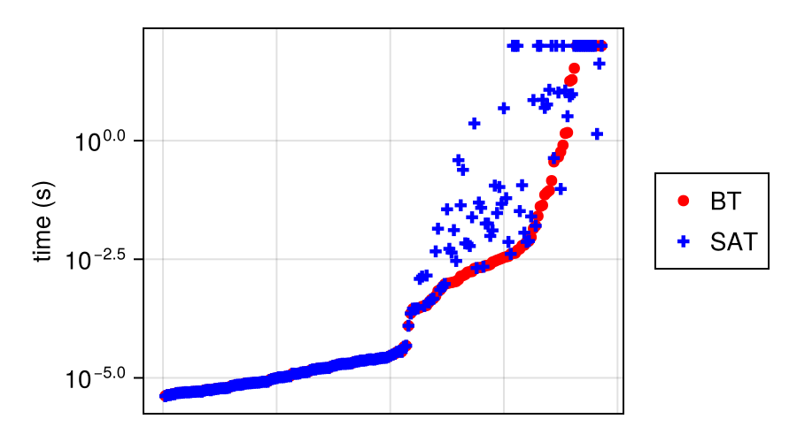

# Benchmarks

To regenerate this file, navigate to the `benchmark` directory and run the following command.
```
julia --project make.jl
```

## Exact Treewidth

To run the exact treewidth benchmarks, navigate to the `benchmark` directory and run the following command.

```
julia --project exact/make.jl
```

The algorithms `BT` and `SAT` are benchmarked on the PACE16 competition medium instances.


